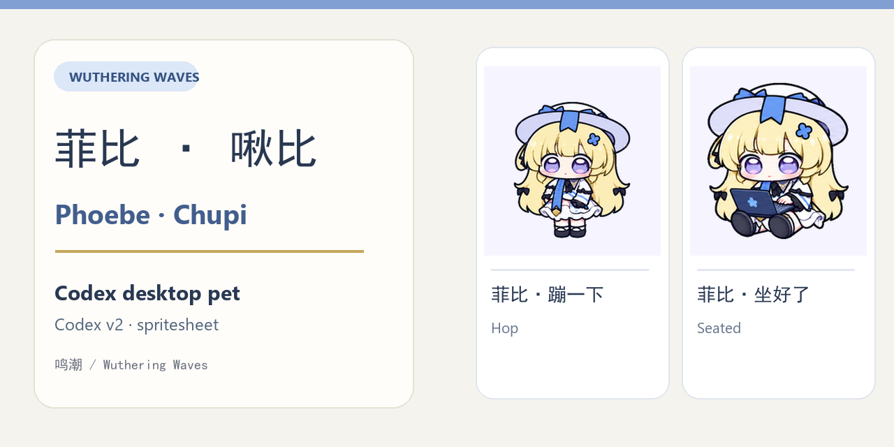

# Phoebe / 菲比 · Codex Desktop Pet

**English** · [中文 README](README.md)

An unofficial Codex desktop pet based on Phoebe (菲比) from Wuthering Waves (鸣潮). This repository contains two Codex v2 spritesheet variants: **菲比·蹦一下** (Hop) and **菲比·坐好了** (Seated). Their animations were inspired by Phoebe's “坐好了” sticker from the “鸣潮·致予新世界” animated sticker collection.



## Variants

| Variant | Install directory | Animation behavior |
| --- | --- | --- |
| 菲比·蹦一下 (Hop) | `pets/phoebe-evidence/` | Sits while idle, gets up and hops on hover, and has a separate working animation. |
| 菲比·坐好了 (Seated) | `pets/phoebe-storyboard/` | Blinks and tilts her head while idle, stays seated on hover, and types on a laptop while working. |

Both variants use the same running animation when dragged left or right. The previews below reuse the existing animated WebP files in this repository.

| Variant | Idle | Hover | Working |
| :---: | :---: | :---: | :---: |
| Hop |  |  |  |
| Seated |  |  |  |

## Installation

Run these commands from the root of a cloned or downloaded copy of this repository. To install one variant, run only its corresponding `cp` command.

```bash
mkdir -p ~/.codex/pets
cp -R pets/phoebe-evidence ~/.codex/pets/
cp -R pets/phoebe-storyboard ~/.codex/pets/
```

Then select “菲比·蹦一下” or “菲比·坐好了” in the Codex desktop pet picker. You can install both variants at once.

## Codex v2 asset format

Each variant contains `pet.json` and `spritesheet.webp`. Both configurations set `spriteVersionNumber` to `2`, and each `spritesheetPath` points to the `spritesheet.webp` in the same directory. The table above previews idle, hover, and working animations; the pet assets also contain the drag-to-run animation.

## Repository layout

```text
.
├── README.md                    Chinese README
├── README_EN.md                 English README
├── assets/
│   ├── social-preview.png       GitHub Social Preview image
│   ├── original-*.webp          Hop previews (idle / hover / coding)
│   └── storyboard-*.webp        Seated previews (idle / hover / coding)
└── pets/
    ├── phoebe-evidence/
    │   ├── pet.json
    │   └── spritesheet.webp
    └── phoebe-storyboard/
        ├── pet.json
        └── spritesheet.webp
```

## Set the GitHub Social Preview

On the repository page, go to **Settings → General → Social preview → Edit → Upload an image…** and upload the local `assets/social-preview.png` file. GitHub may place **Social preview** or label the controls slightly differently; if **General** is not shown, look for **Social preview** in **Settings**. Adding the image to the repository does not set it as the social preview automatically.

## Copyright and disclaimer

© 2026 IraCyoee. This notice applies only to original contributions in this project for which rights may be claimed.

Wuthering Waves, Phoebe, and related original content belong to Kuro Games and their respective rights holders. This is an unofficial fan work and is not affiliated with the Wuthering Waves creators. This notice does not grant rights to use the original content.
